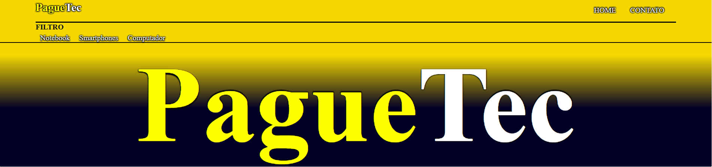
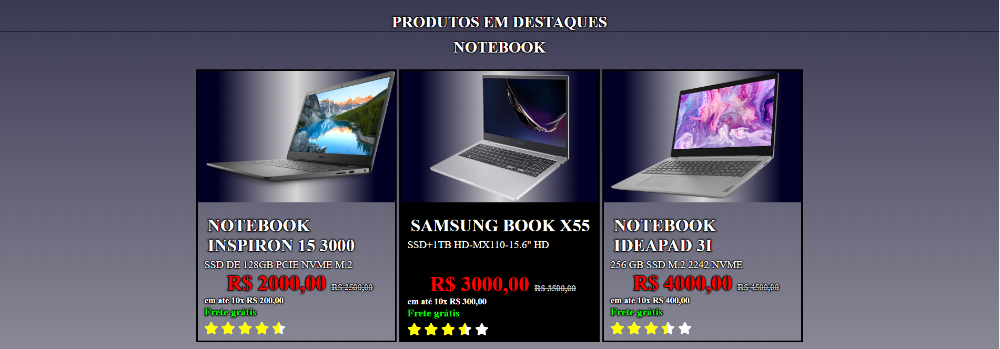
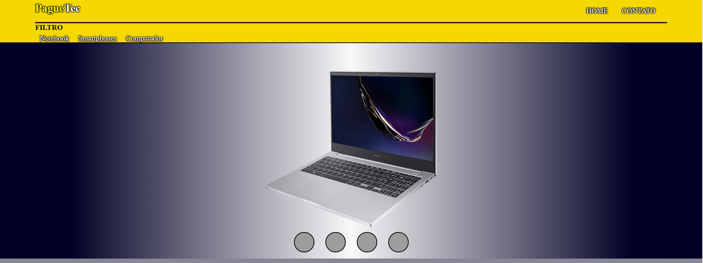

<h1 align="center">
  
</h1>

# DesafiosDaGama
<ol> 
    <li>
        Nome do projeto: <a href="https://jeovanedossantossantos.github.io/PagueTec/" target="_blank"> PagueTec</a> </li>
    <li>
        Ramo: Produtos de tecnologia
    </li>
    <li>
        Descrição:O projeto PagueTec, tem 6 paginas ao todo, a home tem os produtos dispostos em cards,
                os 4 primeiros tem paginas de descrição, contendo fotos, e características do produto
                e as formas de pagamentos.
                Alé da pagina de contado, odem tem uma descirção do poque este projeto foi feito contendo
                um formulário para contado.
    </li>

</ol> 
<h1 align="center">
  
</h1>

# O DESAFIO

Somos parte de uma equipe de desenvolvimento de websites e fomos contratados para a criação de um site de catálogo de produtos. Precisamos desenvolver um site responsivo para nosso cliente contemplando as seguintes características:

Uma vitrine virtual de produtos (no melhor estilo Mercado Livre, por exemplo)

Uma página com detalhes de um determinado produto

Uma página institucional

Como é nossa primeira entrega (nosso primeiro projeto real), vamos tratar aqui com dados “mock”, ou seja, dados fictícios. Como isso funciona? Bom vamos lá resumir o contexto:

Escolha um ramo de atividade do seu cliente: pode ser uma cervejaria artesanal, uma loja de roupas, uma loja de artigos esportivos, não importa. Seu site deverá ter a seguinte navegabilidade:

Página principal com a vitrine dos produtos em destaque (esse esquema Mercado Livre, Submarino, Americanas). Temos que ter a possibilidade de filtrar o conteúdo por departamento, seção ou categoria de produto.

Ao clicar em qualquer produto, mostre uma página com os detalhes deste produto (várias fotos, descrição, preço, condições de pagamento - lembrando que não teremos como efetuar pagamento no site, não teremos nenhuma integração com meios de pagamento)

Independente da página que esteja sendo exibida, algum elemento (pode ser um menu ou um botão) que redirecione para a página com informações institucionais, tipo “quem somos”, “contato” (novamente com texto fictício). Fique a vontade para desenvolver quantas páginas achar interessante.

# ENTREGAS MÍNIMAS
 

Criação do repositório no Github 

No mesmo repositório, commitar as páginas HTML criadas para o projeto:

As páginas devem ser navegáveis (link entre elas, todos os links das página devem estar levando para a página adequada)

CSS implementado de acordo com os guidelines do treinamento

As páginas devem ser responsivas e oferecer boa experiência em diferentes tamanhos de dispositivos.

# CRITÉRIOS DE AVALIAÇÃO

Repositório no Github contendo README.md com descrição do projeto e commits bem descritivos.

O CSS deve ser separado do HTML assim como aprendido em aula, e todos os arquivos devem estar organizados de uma forma que ao baixar o repositório, teremos a capacidade de navegar pelas páginas sem nenhum erro (seja de link quebrado ou algum recurso não carregado na página).

Não vamos considerar os textos do site, no entanto o nome dos produtos e categorias/seção/tipo dos itens devem fazer sentido. Isso quer dizer, se vocês escolherem por exemplo um catálogo de cosméticos:  o nome dos cosméticos tem que fazer sentido (batom, xampu, protetor solar) e assim como suas categorias como por exemplo cabelo, rosto, maquiagem, etc.

As páginas devem ser responsivas. Vamos testar as páginas nas resoluções desktop (1280px) , tablet (1024px)  e celular (375px) . Todas as medidas são de largura da página. 

<h1 align="center">
  
</h1>

